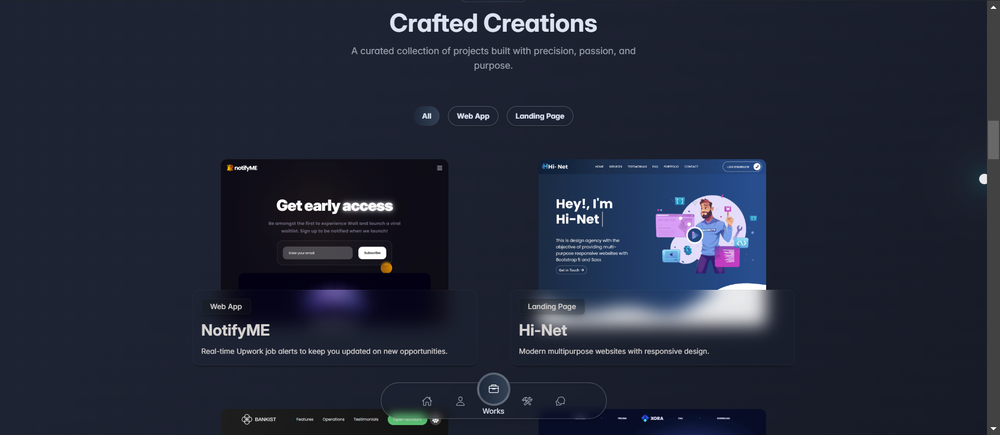
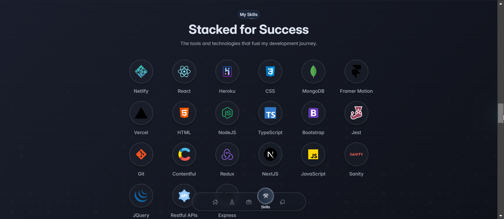
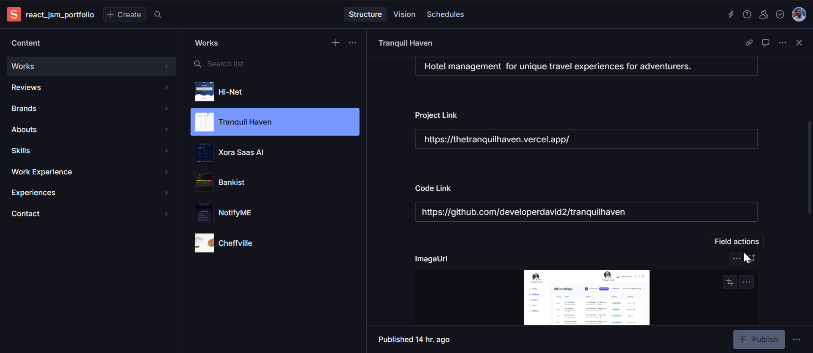

# 🚀 **Jacobs Codes Portfolio**

🎨 **My personal portfolio showcasing my skills, projects, and services.**

---

## 🔥 **Preview**

 &nbsp;
  

  &nbsp;
  

---

## 🛠 **Tech Stack**

🔹 **Frontend:**  
  
  
  

🔹 **CMS & Illustrations:**  
  
  
  

---

## ⭐ **Show Your Support**

💙 **Enjoyed this project? Consider leaving a star!**  
  
